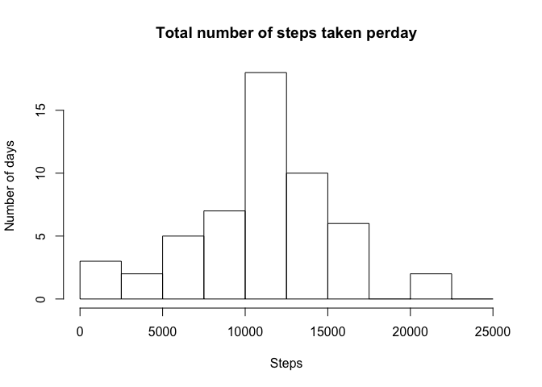
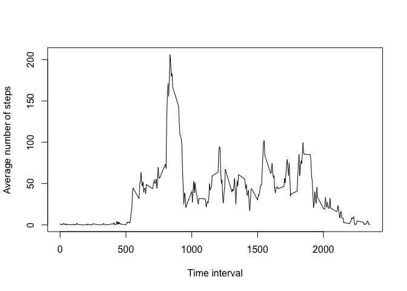
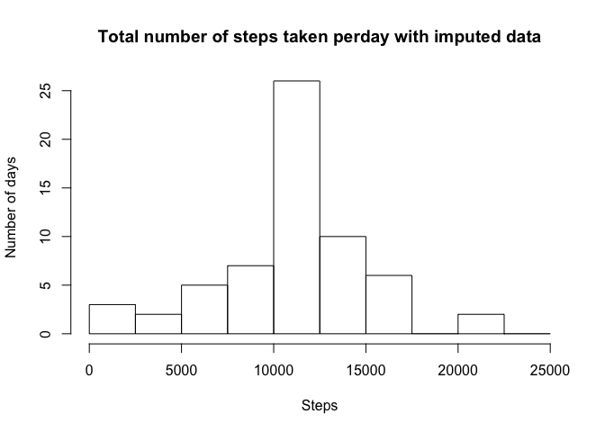
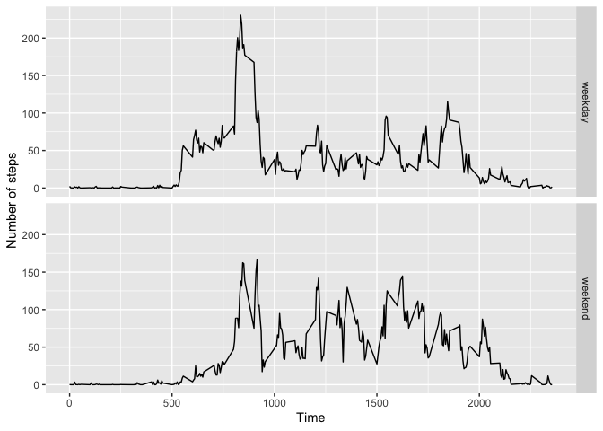

## Loading and preprocessing the data

```r
activity <- read.csv("activity.csv")
```

## What is mean total number of steps taken per day?

```r
#organize the data by date
total_by_day <- aggregate(steps~date, activity, sum)
hist(total_by_day$steps, breaks=seq(0,25000,2500), main="Total number of steps taken perday",
     xlab="Steps", ylab="Number of days")
```

<!-- -->

```r
#calculate and report the mean and median steps taken
mean_steps <- mean(total_by_day$steps)
median_steps <- median(total_by_day$steps)
```

The mean steps taken per day is 10766.19, the median is 10765.

## What is the average daily activity pattern?

```r
#organize the data by time interval
average_by_interval <- aggregate(steps~interval, activity, mean, rm.na=T)
plot(average_by_interval$interval, average_by_interval$steps, type="l",
     xlab="Time interval", ylab="Average number of steps")
```

<!-- -->

```r
#reporting the interval with the max steps taken
max_interval <- average_by_interval$interval[which.max(average_by_interval$steps)]
```

The time interval that has the maximum number of steps is 835.

## Imputing missing values

There are 2304 rows with NAs in the dataset.


```r
#imputing NA with mean steps taken for the corresponding time interval
activity_impute <- activity
for (i in 1:nrow(activity_impute)) {
  if (is.na(activity_impute$steps[i])) {
    curr_time <- activity_impute$interval[i]
    ave_ind <- match(curr_time, average_by_interval$interval)
    interval_ave <- average_by_interval$steps[ave_ind]
    activity_impute$steps[i] <- round(interval_ave, 0)
  }
}
```


```r
new_total_by_day <- aggregate(steps~date, activity_impute, sum)
hist(new_total_by_day$steps, breaks=seq(0,25000,2500), main="Total number of steps taken perday with imputed data",
     xlab="Steps", ylab="Number of days")
```

<!-- -->

```r
new_mean_steps <- mean(new_total_by_day$steps)
new_median_steps <- median(new_total_by_day$steps)
```

The mean steps taken per day is 10765.64, the median is 10762 with imputed data. Filling NA values increased the frequencies in the histogram, especially the middle bin. However, it doesn't change the mean and median significantly as the means for each time interval are used to fill in the missing values.

## Are there differences in activity patterns between weekdays and weekends?

```r
library("ggplot2")

#converting the date to Date datatype
activity_impute$realDates <- as.Date(activity_impute$date, format = "%Y-%m-%d")
activity_impute$weekday <- weekdays(activity_impute$realDates)
activity_impute$weekday_type <- ifelse(activity_impute$weekday %in% c("Saturday", "Sunday"), "weekend", "weekday")

#organize the weekend and weekday data
sep_activity <- aggregate(steps~interval+weekday_type, activity_impute, mean, rm.na=T)
p <- ggplot(sep_activity, aes(interval, steps))
p + geom_line() + xlab("Time") + ylab("Number of steps") + facet_grid(weekday_type ~ .)
```

<!-- -->
